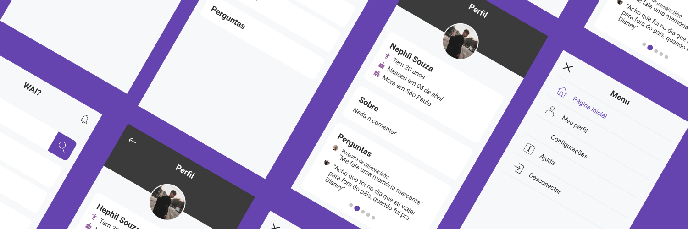

# Conheça a plataforma
> Daremos apenas uma breve descrição do que se trata, mas você pode encontrar toda a documentação oficial do aplicativo na nossa [wiki](https://fiapproject.notion.site/FIAP-Who-Am-I-f2d4e271dd4e4fc7ac93dd0d33eada49).

A ideia geral do projeto será criar uma aplicação web para apresentação pessoal. A plataforma se chamará WAI (abreviação de “Who am I”) e ela irá fornecer um perfil dos usuários com informações pessoais (respeitando todas as normas da LGPD) permitindo que outros usuários a conheça.

Os responsáveis por este projeto são:

* Christian Martins: [https://github.com/christianhsmartins](https://github.com/christianhsmartins)
* Rafaella Santiago: [https://github.com/rsa98](https://github.com/rsa98)





## Começando

Vamos dar algumas instruções para você poder rodar este arquivo no seu local host. O projeto foi construído com ReactJS e nós decidimos montar a base da nossa aplicação com os gerenciadores vite & yarn, eles atenderam bem as nossas necessidades.

## Como instalar

### Primeiros passos

Faça download das dependências obrigatórias:

```
1. git clone https://github.com/rsa98/enterpriseconnectionwai.git
2. cd enterpriseconnectionwai
```

* Instale as dependências para iniciar o servidor:

```
3. vite install
4. yarn install
5. yarn add react-router-dom

```

* Para iniciar o servidor você deve dar o comando:

```
6. yarn dev

```

* Após iniciar o servidor, acesse sua local host:

```
7. http://localhost:3000/

```

## Status atual

Após rodar o servidor a primeira tela que você verá é a solicitada na atividade onde:
* Você deverá acessar o seu CPF;
* As informaçõe serão apresentadas no campo abaixo;